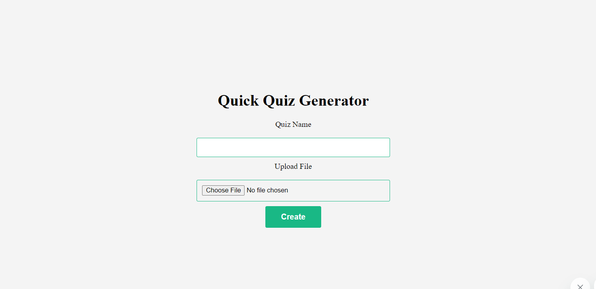

## Quick Quiz Generator

Creating quizzes using traditional methods can be time-consuming and tedious. The Quick Quiz Converter is designed to streamline and simplify the quiz creation process by allowing users to input questions and options through a csv file, eliminating the need for manual setup.

## How It Works:
* The User is prompted to enter the name of the quiz, and a csv files consisting of questions & options.

### Format of CSV FILE
* The format of the CSV file is designed to store information about multiple-choice survey questions, including the question text, options, and correct answers. 
* The number of option columns can vary based on the maximum number of choices per question. For example, one question may have three answer choices, while another may have five. The code dynamically reads and processes these columns, adapting to the specific structure of each question.

#### CSV Headers
1. Question
    * Description: This column contains the textual representation of the survey question.
    * Example: "What is the capital of Italy?"
2. Correct_Option:
    * Description: This column contains the correct option(s) for the survey question. For multiple correct options, the options are separated by underscores (_).
    * Example (Single Correct Option): "Rome"
    * Example (Multiple Correct Options): "Option1Value_Option2Value"
3. Option_1, Option_2, ... :
    * Description: These columns contain the possible options for the survey question. Each option is represented in a separate column.
    * Example: "Rome", "Milan", "Paris", "Berlin"

[CLICK HERE FOR EXAMPLE CSV FILE](https://drive.google.com/file/d/1jgaIR-EUWc2YFHmnjnqNQLFcgqsABnLo/view?usp=sharing)
### Files and Folders
    .
    ├── README.md                 A file for your future self and developer friends to learn about the app
    ├── app                       A folder to place all assets required for frontend components
    │   ├── index.html            A landing page for the user to use the app
    │   ├── scripts               JavaScript to place files frontend components business logic
    │   │   └── app.js
    │   └── styles                A folder to place all the styles for the app
    │       ├── images
    │       │   └── icon.svg
    │       └── style.css
    ├── config                    A folder to place all the configuration files
    │   └── iparams.json
    └── manifest.json             A JSON file holding meta-data for the app to run on the platform
